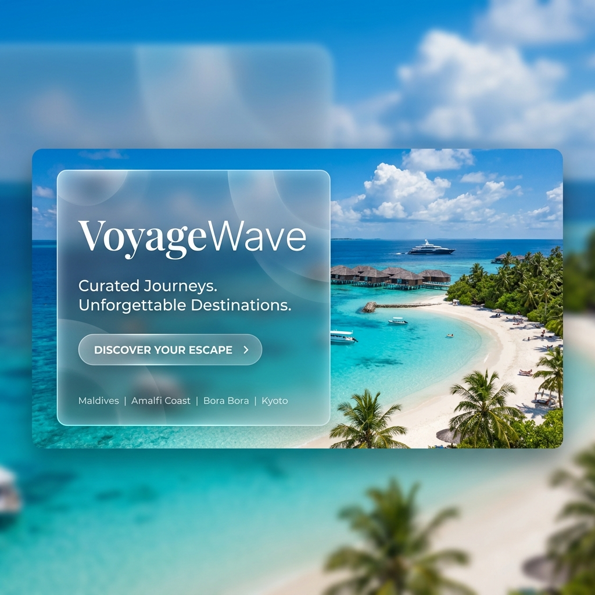

# 🐝 TravelBee — Premium Travel Agency Portal

TravelBee is a high-craft, modern MERN stack travel portal designed for luxury experiences. It features a fluid, responsive design system built with Vite, React, and Tailwind CSS, powered by a robust Node.js/Express/MongoDB backend.



## ✨ Premium Features

- **Custom Animated Cursor**: A dual-layer interactive cursor with magnetic hover effects and variable blend modes.
- **Micro-Animations**: Framer Motion powered page transitions, scroll-parallax sections, and elegant card lift effects.
- **Responsive Navigation**: A mobile-first, full-screen overlay menu with staggered animation links.
- **Glassmorphism UI**: High-end frosted glass elements for cards, modals, and navigation bars.
- **Interactive Testimonials**: Swipeable customer stories with intuitive gesture support.
- **Dynamic Wishlist**: Save your dream destinations with instant UI feedback.
- **Smart Search/Booking**: Smooth date-picking and real-time booking flow with secure badges.

## 🛠️ Tech Stack

**Frontend:**
- React 18 + Vite
- Tailwind CSS (Custom HSL Architecture)
- Framer Motion (State-of-the-art animations)
- React Router 6 (Smooth page transitions)
- React Hot Toast (Elegant notifications)

**Backend:**
- Node.js & Express
- MongoDB with Mongoose
- JWT/Cookie based Authentication
- Helmet & Security Middlewares

## 🚀 Getting Started

### 1. Prerequisites
- Node.js (v16+)
- MongoDB (Running locally or Atlas)

### 2. Installation
Clone the repository and install dependencies:

```bash
# Frontend
cd frontend
npm install

# Backend
cd ../backend
npm install
```

### 3. Database Seeding
Populate the database with premium destinations and packages:

```bash
cd backend
node src/data/seed.js
```

### 4. Running the App
Start both servers simultaneously:

```bash
# Terminal 1: Frontend
cd frontend
npm run dev

# Terminal 2: Backend
cd backend
npm start
```

## 📸 Redesign Preview

Our redesign focused on **fluidity** and **mobile-first responsiveness**. Every breaking point was carefully crafted to ensure the luxury feel translates from ultra-wide monitors down to standard smartphones.

> [!TIP]
> Use the custom cursor to hover over destination cards to experience the smooth magnetic scaling and shimmer loading states.

---
Crafted with ♡ for TravelBee travelers worldwide.
